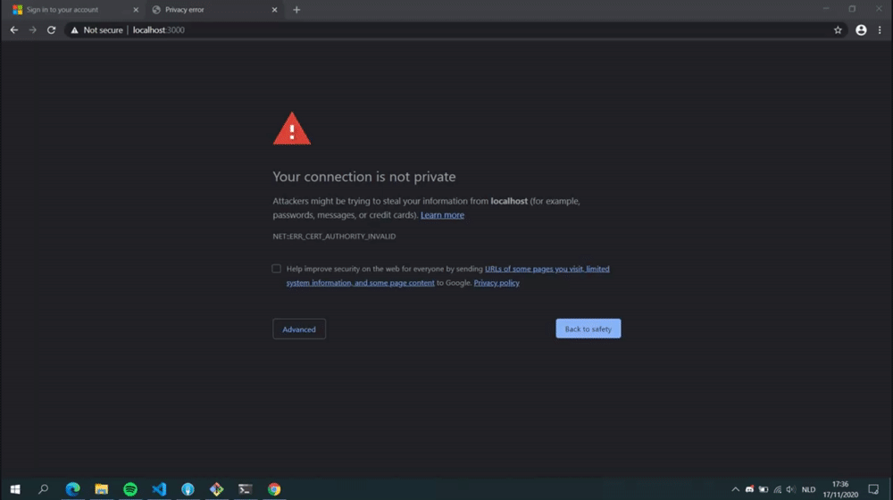
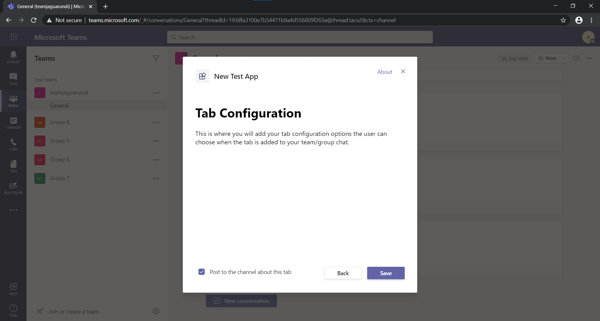

## Integratie met een al bestaande app

In de documentatie die hierboven staat wordt een apart project aangemaakt voor de Teams, maar je kan ook een al bestaande app integreren met Teams. De applicatie checkt of hij in Teams zit, en als dat het geval is laat hij andere pagina's zien.

1. Maak een [create-react-app](https://create-react-app.dev/)
2. Maak een bestand aan genaamd `.env` in de root van je folder en zet er het volgende in: `HTTPS=true`. Voor gebruikers in een Mac omgeving kan je een .env.local met eventueel [een lokaal certificaat](https://flaviocopes.com/macos-install-ssl-local/). Hierna moet in de browser (als je niet op Mac een lokaal certificaat heb gemaakt) de stappen in de gif hieronder uitproberen.



3. Zorg ervoor dat je repo de `@microsoft/teams-js` node module heeft en checkt of er Teams gebruikt wordt. Dit doe je door op de `App.js` pagina te checken of de applicatie draait in een iframe. Zie ook onderstaande code.

```js
// check if Teams SDK exists
if (microsoftTeams) {
  // if the application isn't in Teams,
  // use this, else initialise Teams
  if (window.parent === window.self) {
    return (
      <Router>
        <Route exact path="/" component={Home} />
        <Route exact path="/privacy" component={Privacy} />
        <Route exact path="/termsofuse" component={TermsOfUse} />
        <Route exact path="/tab" component={TeamsHostError} />
        <Route exact path="/config" component={TeamsHostError} />
      </Router>
    );
  }

  // Initialize the Microsoft Teams SDK
  microsoftTeams.initialize();

  // Display the app home page hosted in Teams
  return (
    <Router>
      <Route exact path="/tab" component={Tab} />
      <Route exact path="/config" component={TabConfig} />
    </Router>
  );
}
```

4. Daarna kan je de homepagina van de Teams app toevoegen, meestal `Tab.js` genoemd. Ook heb je een `config` bestand, `TabConfig.js` waarin de URL voor de homepagina staat. En een pagina die getoond wordt tijdens het installeren, zoals hieronder weergeven.



5. Installeer "App studio" in je Microsoft Teams. Navigeer hier naartoe en selecteer `Edit Manifest` en daarna `Create a new app`.
6. Vul de pagina `App details` helemaal in en klik daarna aan de linkerkant op `Tabs` en selecteer je config bestand (waarschijnlijk https://localhost:3000/config). Scroll aan de linkerkant helemaal naar beneden en selecteer `Test and distrubute`. Nu kan je op `Install` drukken en de app toevoegen aan een team.

Als je niet uit stap 3 of 4 kwam, kan je kijken naar het [react-teams-app](react-app-teams). In dit voorbeeld zijn de pagina's die in Teams zichtbaar zijn niet zichtbaar in een normale browser omdat die de Teams SDK gebruiken.

Nu heb je een web applicatie die zowel dingen in de web browser kan laten zien als in een Teams tab. Tijd om code te gaan kloppen!
