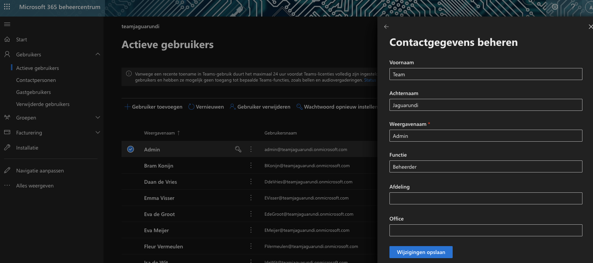

# Onderzoek Microsoft Identity Platform

Dit document bevat het resultaat van ons onderzoek naar MS identity platform. Er is gekeken naar hoe er binnen de applicatie onderscheid gemaakt kan worden tussen de verschillende rollen.

## Inhoudsopgave

<!-- TOC -->

- [Onderzoek Microsoft Identity Platform](#onderzoek-microsoft-identity-platform)
  - [Inhoudsopgave](#inhoudsopgave)
  - [Ophalen gebruikergegevens](#ophalen-gebruikergegevens)
  - [oAuth-flow](#oauth-flow)
    - [Voorbereidingen](#voorbereidingen)
    - [Sign in with Microsoft](#sign-in-with-microsoft)
    - [Gebruik JWT-token](#gebruik-jwt-token)
  - [Identificeren rol teams gebruikers](#identificeren-rol-teams-gebruikers)
  - [Rol toevoegen/wijzigen gebruiker](#rol-toevoegenwijzigen-gebruiker)
  - [Code example](#code-example)

<!-- /TOC -->

## Ophalen gebruikergegevens

Binnen het project willen we dat gebruikers kunnen inloggen met een office-365 account. Nadat een gebruiker is ingelogd, willen wij op basis van de gebruikersrol bepalen tot welke pagina's de desbetreffende gebruiker toegang heeft.

Uit onderzoek blijkt dat het 'inloggen via microsoft' mogelijk is via het oAuth2 principe. Hiermee kunnen er gebruikergevens van een persoon opgehaald worden, zonder dat deze gebruiker steeds hoeft in te loggen.

## oAuth-flow

In dit hoofdstuk is beschreven hoe de oAuth flow van Microsoft werkt.

### Voorbereidingen

Onderstaande voorbereidingen zijn getroffen.

1. Opzetten van een office-365 omgeving.
2. Testgebruikers toegevoegd aan office omgeving.
3. Tentant-ID aangevraagd via Azure AD.

### Sign in with Microsoft

We willen dus eenmalig autoriseren en vervolgens data ophalen zonder in te loggen.

Data ophalen zonder in te loggen is mogelijk door gebruik te maken van tokens/sleutels. In onderstaande afbeelding wordt uitgelegd hoe dit werkt.


1. Je logt in via een pagina binnen de react app.
2. Er wordt verwezen naar /auth op de back-end
3. /auth redirect naar Microsoft login in.
4. Na validatie returned microsoft een token.
5. Deze token wordt opgeslagen als sessie
6. In de react app wordt er met een cookie verwezen naar de sessie met de token.

In het JSON file hieronder kan je zien welke response Microsoft stuurt. de accesToken wordt opgeslagen als sessie.

```json
{
  "uniqueId": "a0b8e924-e659-43d7-a071-bad869ee9ab6",
  "tenantId": "f0abd04a-9b19-44ba-9184-312e8524f92e",
  "scopes": ["openid", "profile", "User.Read", "email"],
  "account": {
    "homeAccountId": "a0b8e924-e659-43d7-a071-bad869ee9ab6.f0abd04a-9b19-44ba-9184-312e8524f92e",
    "environment": "login.windows.net",
    "tenantId": "f0abd04a-9b19-44ba-9184-312e8524f92e",
    "username": "admin@teamjaguarundi.onmicrosoft.com",
    "name": "Team Jaguarundi"
  },
  "idToken": "extreem lang",
  "idTokenClaims": {
    "aud": "4d0fb969-916b-42e5-8cdd-65a7f43fb847",
    "iss": "https://login.microsoftonline.com/f0abd04a-9b19-44ba-9184-312e8524f92e/v2.0",
    "iat": 1605702728, // Issued at time
    "nbf": 1605702728, // Not before
    "exp": 1605706628, // Expires
    "name": "Team Jaguarundi",
    "oid": "a0b8e924-e659-43d7-a071-bad869ee9ab6",
    "preferred_username": "admin@teamjaguarundi.onmicrosoft.com",
    "rh": "0.AAAAStCr8BmbukSRhDEuhST5Lmm5D01rkeVCjN1lp_Q_uEd6AMI.",
    "sub": "wnxYFHb-7GkrRM8x6lKXcGoZ-vfTbLcyK7qdow7flZI",
    "tid": "f0abd04a-9b19-44ba-9184-312e8524f92e",
    "uti": "Yi5DwRx6JUqyjUKpgZcaAA",
    "ver": "2.0"
  },
  "accessToken": "Extreem lang"
  "fromCache": false,
  "expiresOn": "2020-11-18T13:37:08.000Z",
  "extExpiresOn": "2020-11-18T14:37:07.000Z",
  "familyId": null,
  "tokenType": "bearer",
  "state": ""
}

```

---

### Gebruik JWT-token

Wanneer er een JWT-token is gegenereerd kan er data opgehaald worden. Dit doen we door de token mee te sturen tijdens een API request. Een token wordt als bearer token meegeven als authorization header. In onderstaand voorbeeld wordt de persoonlijke data opgehaald via teams.

**`GET`** : `https://graph.microsoft.com/v1.0/me`

**header**
`Authorization: Bearer {token hier}`

**Returns**

```json
{
  "@odata.context": "https://graph.microsoft.com/v1.0/$metadata#users/$entity",
  "businessPhones": [],
  "displayName": "Admin",
  "givenName": "Team",
  "jobTitle": "Beheerder",
  "mail": "admin@teamjaguarundi.onmicrosoft.com",
  "mobilePhone": null,
  "officeLocation": null,
  "preferredLanguage": "en-GB",
  "surname": "Jaguarundi",
  "userPrincipalName": "admin@teamjaguarundi.onmicrosoft.com",
  "id": "a0b8e924-e659-43d7-a071-bad869ee9ab6"
}
```

## Identificeren rol teams gebruikers

Het identificeren van een gebruikersrol is vrij eenvoudig. In de JSON van het hoofdstuk hierboven zie je dat de response een key `jobTitle` heeft.

Met de waarde van deze key kunnen we de rol van een gebruiker identificeren.

## Rol toevoegen/wijzigen gebruiker

---

Naast het ophalen van rollen willen we deze ook kunnen aanmaken en wijzigen. Dit kan als volgt:

1. Bezoek het [Microsoft Admin panel](https://admin.microsoft.com/Adminportal/)
2. Klik links op de tab `Gebruikers`
3. Klik vervolgens op `Actieve gebruikers`
4. Selecteer een gebruiker of maak een nieuwe aan.
5. Klik in het uitschuifmenu op `contactgegevens beheren`
6. Wijzig de input `Functie` en sla dit vervolgens op.



---

## Code example

In deze folder bevind zich ook een code example, deze is te starten als volgt:

1. `npm install`
2. `node index`
