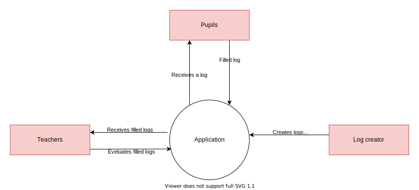

# Software guidebook

## Table of content

---

- [Context](#)
- [Functional Overview](#)
- [Quality Attributes](#)
- [Constraints](#)
- [Principles](#)
- [Software Architecture](#)
- [External interfaces](#)
- [Code](#)
- [Data](#)
- [Infrastructure Architecture](#)
- [Deployment](#)
- [Operation and Support](#)
- [Decision Log](#)

## 1. Context

In this chapter you'll find the scene of this project. Here we start with explaining what the software is all about, and what it is we are building.

Thereafter we explain how this project will fit in the existing environment. And last but not least we describe who are using this software.

### 1.1 What this project is about

In this project an assignment is being realized for the course DWA (development web applications).

The project team consists of five students. Who work together on a software tool.

### 1.2 What it is that's being built

In this project we develop a software tool that supports teachers by tracking the progress of their pupils.

The intention is that pupils keep a digital log, in this log they indicate for each learning goal whether this is clear or not.

Based on the logs of pupils, teachers can provide support.
Log

### 1.3 How this software fits into its current environment

In the current environment they already make use of logs. Only at the moment these are paper logs.

The principle remains the same. only the environment undergoes a digital transformation.

### 1.4 Different roles

In the software we work with three different roles. In the list below we describe the roles and their use within the software.
| # | Role | Task |
|----|-------------|------------------------------------------|
| 1. | Log creator | Creates logs for different school years. |
| 2. | Log creator | Adds learning goals to logs. |
| 3. | Log creator | Prepares logs for teachers. |
| 4. | Teachers | Evaluate logs of pupils. |
| 5. | Pupils | Fills in logs for current learning goal. |

### 1.5 Context diagram

In the context diagram below the coherence between the different roles is shown.

---

## 2. Functional overview

In this chapter you'll find different diagrams, drawings and tables that helps understand how the software is working.

### 2.1 user stories

In the table below the different user stories are described.

| #    | Description                                                                                                                                                                                                                                    |
| ---- | ---------------------------------------------------------------------------------------------------------------------------------------------------------------------------------------------------------------------------------------------- |
| US01 | Als leerling wil ik een logboek invullen zodat ik kan inschatten bij welke leerdoelen ik hulp nodig heb                                                                                                                                        |
| US02 | Als logboekontwerper wil ik per blok leerdoelen kunnen toevoegen zodat ik de leerkracht kan helpen met het voorbereiden van een blok.                                                                                                          |
| US03 | Als logboekontwerper wil ik een logboek kunnen aanmaken zodat ik de leerkracht kan helpen met het voorbereiden van een blok.                                                                                                                   |
| US04 | Als leerkracht wil ik dat er automatisch in Microsoft Teams een agenda item komt te staan voor elke les zodat ik een overzicht heb van de lessen in een blok.                                                                                  |
| US05 | Als leerkracht wil ik een snel en makkelijk overzicht van de ingevulde logboeken zodat ik in de les snel kan kijken of een leerling assistentie nodig heeft.                                                                                   |
| US06 | Als leerling wil ik in mijn bestaande Microsoft Teams omgeving gebruik maken van de applicatie zodat ik geen nieuwe programma's en accounts hoef te gebruiken.                                                                                 |
| US07 | Als leerkracht wil ik een logboek kunnen toevoegen aan mijn teams omgeving. (Als leerkracht wil ik in mijn bestaande Microsoft Teams omgeving gebruik maken van de applicatie zodat ik geen nieuwe programma's en accounts hoef te gebruiken). |
| US08 | Als logboekontwerper wil ik het logboek kunnen aanpassen wanneer het al is ingevuld zodat ik fouten kan corrigeren.                                                                                                                            |
| US08 | Als leerkracht wil ik dat de leerlingen die aangegeven hebben in het logboek hulp nodig te hebben automatisch worden toegevoegd aan de juiste les zodat ik de les kan houden met alle leerlingen die hulp nodig hebben.                        |
| US10 | Als leerkracht wil ik een overzicht krijgen van oude logboeken zodat ik kan zien hoe de klas denkt te presteren.                                                                                                                               |
| US11 | Als leerling wil ik een speels uiterlijk zodat de applicatie mijn aandacht trekt.                                                                                                                                                              |
| US12 | Als leerling wil ik een chatbot die ik om hulp kan vragen tijdens het invullen van mijn logboek zodat ik dat zonder problemen kan doen.                                                                                                        |
| US13 | Als logboekontwerper wil ik voor het logboek templates kunnen gebruiken zodat ik een logboek voor een niveau maar één keer hoef te maken.                                                                                                      |
| US14 | Als leerkracht wil ik 2FA kunnen gebruiken zodat mijn informatie veilig blijft.                                                                                                                                                                |
| US15 | Als logboekontwerper wil ik automatisch de leerdoelen uit de leermethode halen zodat ik de leerdoelen niet elke keer opnieuw zelf hoef in te vullen.                                                                                           |
| US16 | Als logboekontwerper wil ik een logboek dat ik aan het bewerken ben opslaan als concept zodat ik een logboek niet in één keer hoef af te maken.                                                                                                |
| US17 | Als leerkracht wil ik kunnen kiezen voor een donker thema zodat ik ook in donkere omgevingen kan werken.                                                                                                                                       |
| US18 | Als leerkracht wil ik notities bij een leerling kunnen bijhouden zodat ik belangrijke info niet vergeet.                                                                                                                                       |

### 2.2 use cases (optional)

Down below you'll find various use cases that explains how the software is used.

_optional use cases_

### 2.3 UML-diagram (optional)

_optional uml diagrams_

### 2.4 Wireframes

---

## 3. Quality attributes

In this chapter you'll find the quality attributes which the software must meet.

<!-- zie pdf voor toelichting  -->

### 3.1 Performance

<!-- Smart gedefineerd

    e.g. latency and througput
 -->

### 3.2 Scalability

<!-- Smart gedefineerd

    e.g. data and traffic volumes
 -->

### 3.3 Availability

<!-- Smart gedefineerd

    e.g. uptime,downtime, scheduled maintenance, 24x7, 99.9% etc
 -->

### 3.4 Security

<!-- Smart gedefineerd

    e.g. authentication, authorisation ,data confidentiality etc
 -->

---

## 4. Constraints

---

## 5. Principles

---

## 6. Software Architecture

---

## 7. External interfaces

---

## 8. Code

---

## 9. Data

---

## 10. Infrastructure Architecture

---

## 11. Deployment

---

## 12. Operation and support

---

## 13. Decision log

---
